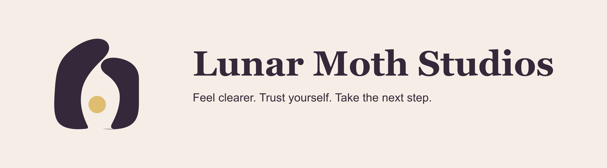
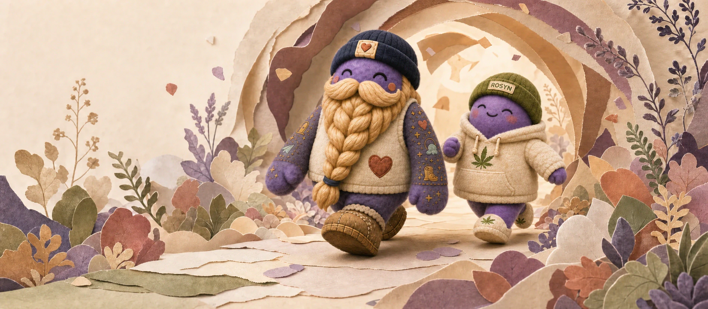
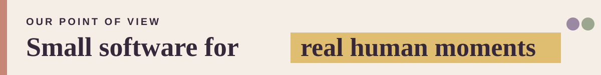
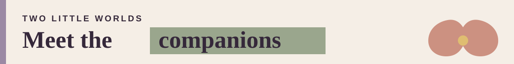
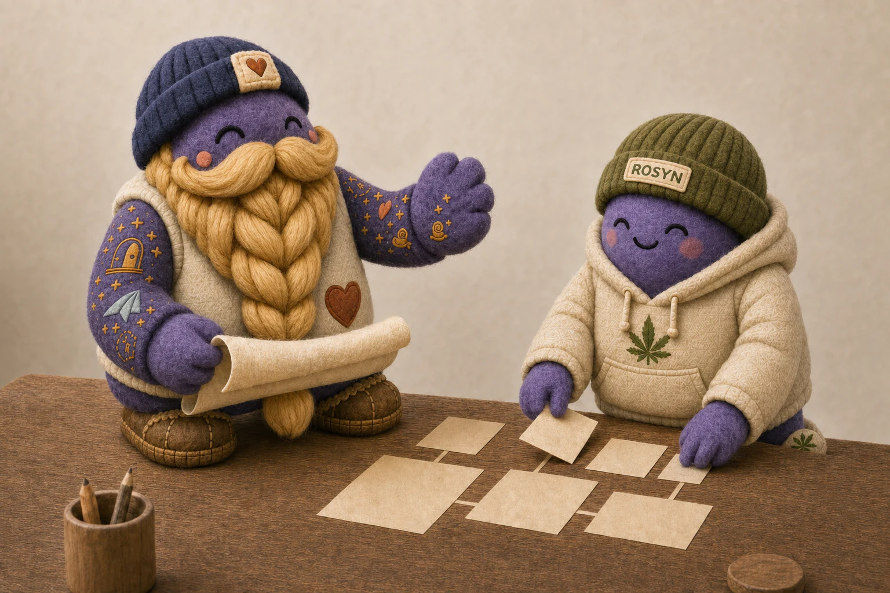
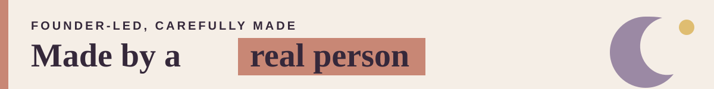
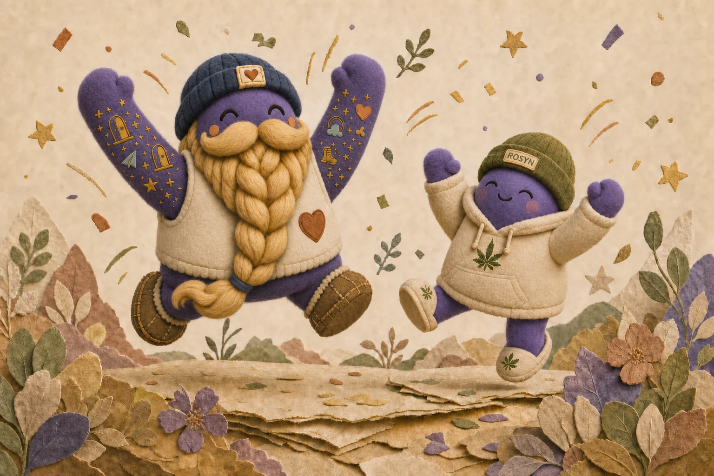
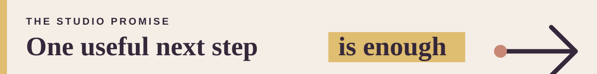

  

  

  

  <strong>Warm, character-led apps for clarity, courage, and everyday self-trust.</strong>
   
  Soft on the person. Useful in the moment.

  <a href="https://www.lunarmothstudios.com"><strong>Visit the studio</strong></a>
  &nbsp;·&nbsp;
  <a href="#meet-the-companions">Meet the companions</a>
  &nbsp;·&nbsp;
  <a href="#how-we-build">How we build</a>

---

<h2>
  
</h2>

Lunar Moth Studios makes cozy companion apps for the moments when someone needs a little more clarity, courage, or self-trust.

Not another dashboard telling you to become a different person. Not a streak waiting to make you feel guilty. Just a warm, practical place to pause, notice what is true, and take one useful next step.

<h2>
  
</h2>

  

<h3>
  
</h3>

BRAM helps you do one small brave thing a day. He makes the action smaller, stays with you at the threshold, and celebrates the attempt.

> **Confidence comes after you try.**

<h3>
  
</h3>

Rosyn helps you understand your cannabis habits more clearly through calm, private tracking and reflection.

> **Notice the pattern. Choose what comes next.**

Different little worlds, same studio promise: you should leave feeling more supported—not more managed.

*Rosyn is designed for adults 21+ and supports tracking and reflection; it does not provide medical advice.*

<h2>
  
</h2>

### Make the next step smaller

Good software does not need to lecture. It can make one useful action feel possible.

### Support without shame

No punishment loops. No performative perfection. No pretending ordinary difficulty is a moral failure.

### Give the work a soul

Characters are not decoration here. They carry tone, make hard moments easier to enter, and help each product feel like a place worth returning to.

### Keep the boundaries honest

Our apps can support reflection and action. They do not replace people, therapy, or medical care—and they should never pretend otherwise.

<h2>
  
</h2>

This organization is the working home for our companion apps, little tools, visual systems, experiments, and the foundations beneath them.

Some rooms are public. Others still look like a maker table at midnight: paper everywhere, one icon two pixels off-center, and a promising idea refusing to go to bed.

<h2>
  
</h2>

Lunar Moth Studios is built by [Mike Van Amburg](https://github.com/MikesHorcrux), a founder and maker who keeps returning to one question:

> How can software help someone feel a little more supported in their actual life?

The answer changes shape. The care underneath it does not.

  

<h2>
  
</h2>

You do not have to carry this alone. There is room to pause, room to be awkward, and room for whatever comes next.

  <a href="https://www.lunarmothstudios.com"><strong>Step inside Lunar Moth Studios →</strong></a>

  Carefully made by Lunar Moth Studios, LLC.

